# FACTORED DATATHON - BIFROST ANALYTICS

## CHALLENGE 

 Create an innovative data solution (web apps, chatbots, dashboards, 
model interfaces...) to empower businesses with insights from product 
reviews.
 
 
With an Amazon products review dataset you will embody a product 
company's data team and develop an end-to-end data solution, to 
generate actionable insights to inform stakeholders' decisions.
 
 
● What has the most significant impact on customer satisfaction?
 
● Can we infer customer segment based on their review patterns?
 
● It's possible to build a recommendation system based on 
recommendations?

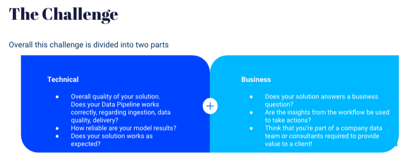

### 1. DATA ARCHITECTURE

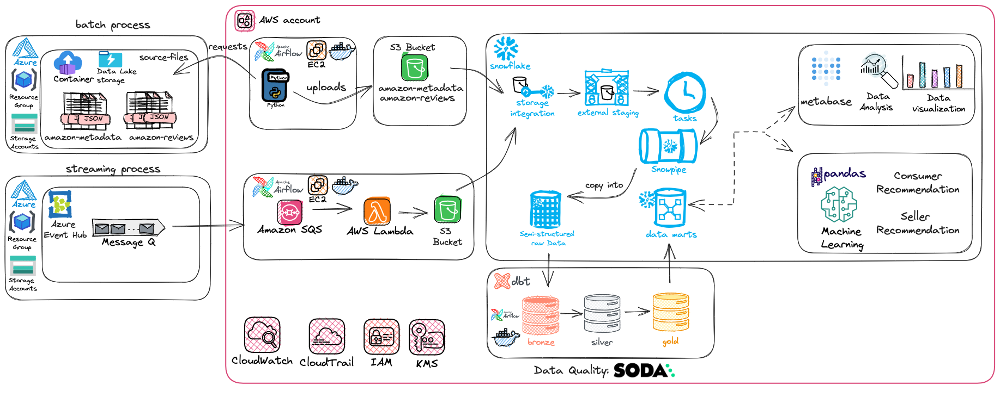

 The approach that Bifrost Analytics used to provide insights from de Data Sources was creating a Lambda Architecture Solution, 
    because the source of Amazon Reviews and Amazon Metadata was from Batch and Streaming process. 

#### BATCH AND STREAMING

<b>BATCH:</b> We've developed a Python application for handling Batch data, specifically extracting data from Amazon-metadata and Amazon-reviews. This data originates from Azure Data Lake Storage. To automate this process seamlessly, we used the power of Astro CLI, a user-friendly tool from Astronomer that allows us to use Apache Airflow through the command line and then deploy in AWS with Astro Cloud and we send this data to an AWS S3 bucket.

<b>STREAMING:</b> Azure Event Hub is the Amazon streaming data source. A well-coordinated combination of Amazon SQS and AWS Lambda was used to provide seamless data extraction and processing. This dynamic extracts data from Azure Event Hub and orchestrates its arrival into AWS S3 Bucket efficiently.

To both Batch and Streaming, we established a Storage Integration to connect the S3 buckets to the robust Data Platform <b>Snowflake</b>. Within Snowflake, we created External Stages, Tasks, and Snowpipes to automate the ingestion of Amazon data into RAW tables. Additionally, we worked with dbt core (Data Build Tool) within Astro CLI and Soda to perform data transformations through the bronze, silver, and gold layers, while maintaining data quality throughout the entire process.

This approach enabled us to provide Data Scientist and Data Analyst with access to high-quality, readily available data to drive meaningful decisions, discoveries and valuable insights.

 

### 2. DATA QUALITY

 With [Soda](https://www.soda.io/) we could be able to deliver trust data. During the process we discovered some inconsistences throught this wonderful tool.
##### 1. Percentage of Duplicate data in Amazon Metadata: 
 

 Thought this warn check we created an incident and discovered that some data were duplicated since the origin, with the same data in the same file. It was possible to discover that 1,62% of amazon's metadata data was duplicated (almost 245k records) and have a treatment for this mitigating those duplicate data.

 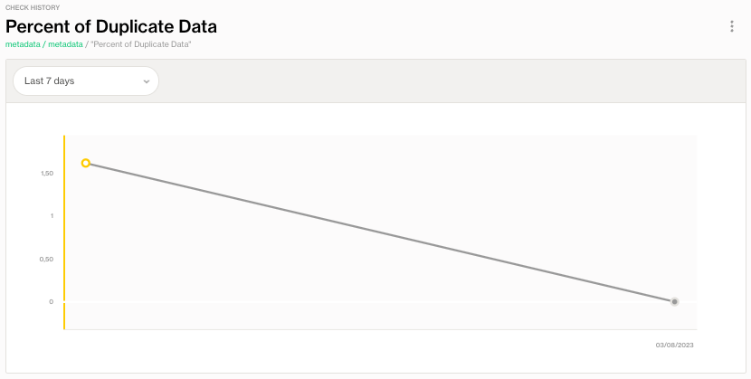

##### 2. Null Values in price column in Amazon Metadata: 
 

 Thought this fail check we were able to see that almost 55% of Metadata values were without price and developed a strategy to step over this problem. Our Strategy was update the null prices with the average price of the product's category. So we transformed this useless column for almost 8.3 million of records into a rich source to provide some insights

 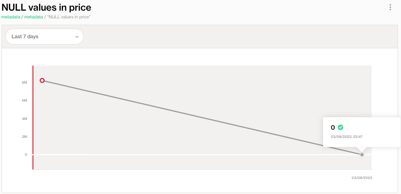

##### 3. Percentage of Duplicate data in Amazon Reviews: 
 

 We were able to identify with this warn bellow that we had almost 1% of the total amazon reviews data duplicated, with a main why - Reviews that were spammed with like more than 1 equal review (same overall, same text, same user, same product) with one tiny difference the summary, so for 1 product we could have like 12 same reviews differing just the summary and it could spoil the final analysis.

 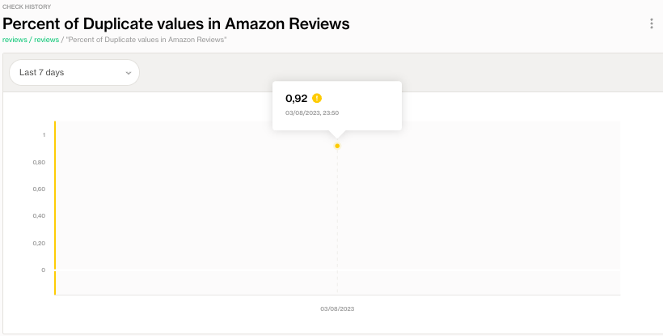

### 3. DATA SCIENCE: Building a Recommender System for Customers and Sellers

##### 3.1 Recommender System for Customers

 We developed a recommendation engine that suggests new products based on historic purchase data. 

The development of this recommendation algorithm had as its main motivating source the need to deliver to the customer an enhanced experience in discovery from their first purchase on the platform. From this point on, the more interactions (purchases) a customer makes, the more immersive their experience should be.

There are two main objectives in this recommender system:

<b>1. Recommendation Similarity: </b> To create a list of similar products for all products, formed by other products of the same main category and that have the average evaluation score equal or higher than 4.

<b>2. Personalized Recommendation:</b> Based on the last purchased products, form a personalized recommendation list with new similar products.

##### 3.1.1 Data Preparation

The process of preparing the data for model building was separated into five steps: 

<b> 1. Text Cleaning: </b> Removal of all special characters, punctuations and conversion of accented letters to plain letters;

<b> 2. Tokenizing: </b> Transformation of the event_text column, returning a list of tokens;

<b> 3. Remove Stopwords: </b> Removal of all stopwords present in the token lists; 

<b> 4. Count Words: </b> Counting the total number of significant words in each event and filtering to keep only events that have more than 32 significant words; and

<b> 5. Count Vectorizer: </b> use of the count vectorizer algorithm to transform the texts worked on so far into numerical data.

##### 3.1.2 Weighted Alternating Least Squares

After preparing the data, we can proceed to use the Weighted Alternating Least Squares <b> (WALS) </b> algorithm. Although we are using a Content-Based approach for each product, WALS is a Collaborative Filtering algorithm. A collaborative filtering model aims to optimize user vectors and item vectors, seeking to minimize the difference between predicted and actual user ratings. In the case of this algorithm, the user figure is represented by the content of the products (which was treated in the previous steps), and the items are the characteristics of these products, In this way, we will be able not only to find the most similar products to each other but also to find niches and new segmentations of groups among the products. At this point, the first step to use the WALS algorithm is to apply the Best Matching 25 (BM25) algorithm to the processed data of product texts. This is a weighting algorithm for collaborative filtering, with which the input values of the matrix that will be used in WALS will be adjusted, taking into account the frequency of terms and statistical relevance.

##### 3.1.3 Similarity Recommendations

Applying the WALS algorithm to our data, we produce our first recommendation. A dataframe with a list of the most similar products to another given product. This recommendation can be used on product pages to further increase the user's range of options, and will also be used as a post-purchase strategy, either individually for the user to remain entertained in that product niche or as part of the personalized list that will have the user's entire purchase history.

##### Example of Similarity Recommendations

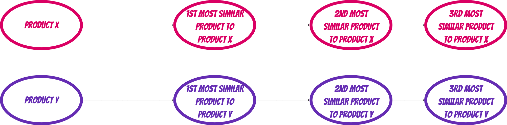

The amount of recommendations is up to the user. In our study case we provided 16 recommendations for each product

##### 3.1.4 Personalized Recommendations

The recommendation experience is made more immersive by building personalized recommendations. This step dynamically builds a unique list of recommendations based on the last events purchased by the user.

##### Example of Personalized Recommendations

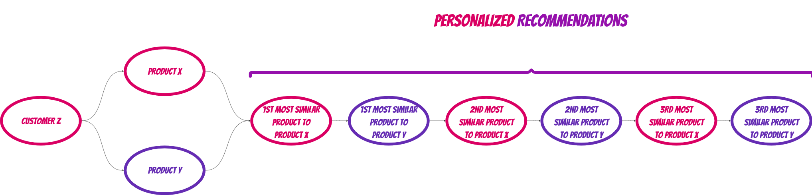

Through the WALS algorithm, each product now has a list of similar products, ordered from most to least similar. Through the table detailing the products purchased, the two tables are joined in an alternating manner, as in the example above.

##### 3.2 Recommender System for Sellers

 We built a seller feedback analysis tool that identifies common complaints and provides detailed insights on product quality. 

This algorithm aims to provide data as value to salespeople, making them data-driven in their decision making and sales strategies.

The process of preparing the data for model building was separated into five steps:

<b> 1. Sentimental Analysis: </b> Training a Support Vector Machine (SVM) classifier to capture the sentiment towards the seller's products

<b> 2. Focus on what's not good: </b> A view of the top negative comments is built so that sellers can know, in real time, which products need adjustments.

<b> 3. Clustering by type of comments: </b> Product reviews are grouped through an algorithm so that the seller can quickly get a view of how many macro actions will be needed.

<b> 4. Word clouds: </b>  For each group formed by artificial intelligence, a word cloud graphic is created that facilitates the visualization of the key words of the evaluations.

<b> 5. Classification model: </b> If sellers want to have an even greater immersion, the specific classification model for their products is made available. In this way, as new evaluations arrive, the buyer will know if the feelings are positive or negative, according to the parameters that he himself will define

<b> 6. Seller Auto Service: </b> We offer all these analytics as a customized service to our client, giving them the freedom to select which products, which date space or even which product categories they want to gain insights into improvement points. For each combination there will be a different model

##### 3.2.1 Support Vector Machine (SVM)
 

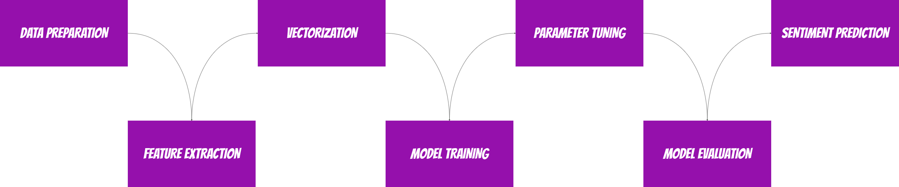

 

##### 3.2.2 Clustering with K-Means

For each classification model we create (based on seller preference data) we also proceed with the clustering algorithm to group complaints into more specific niches. The clustering method used was K-Means and the method for choosing the optimal number of clusters was the silhouette method. In this way it is possible to create a recursive process that automatically chooses the optimal number k based on the seller's data

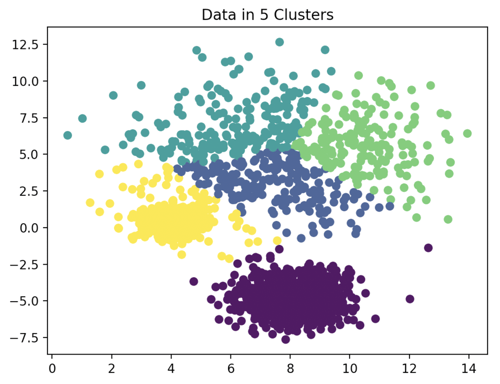

##### 3.2.3 Visualizing Negative Reviews with Word Clouds

Word clouds help to quickly visualize the biggest pains in each of the specific niches that were created from the clustering.

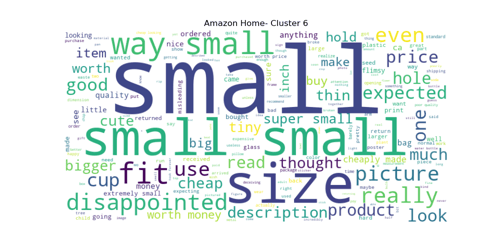
 
### 4. ANALYTICS

##### 4.1 REVIEW ANALYSIS DASHBOARD 

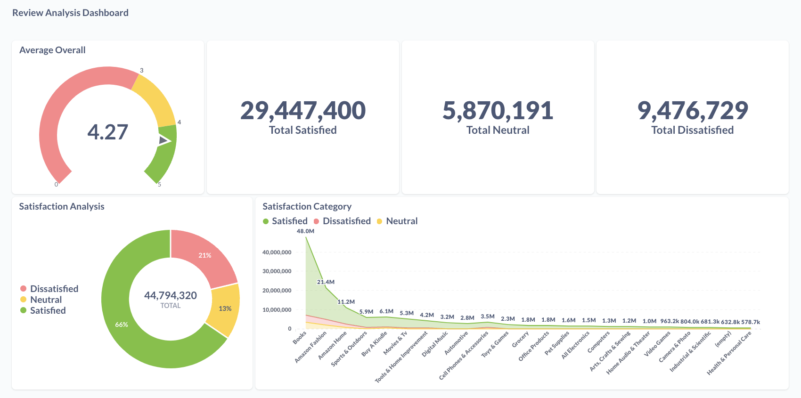

##### 4.2 PERSONALIZED RECOMMENDATIONS 

 Number of recomendations per review per reviewer 

 We can see that to the reviewer Rondell R. (in the second line) based on his review of the product <b >"Dark Iron Fitness Genuine leather" </b> we had 8 recommendations for him on other products. 

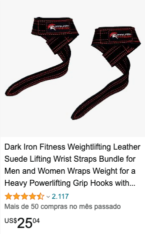

 

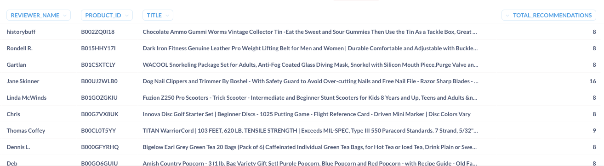

 

###### PRODUCT RECOMMENDATIONS:

 Example: ACHIEVE FIT Weightlifting Gloves - Leather Palm for Fitness 

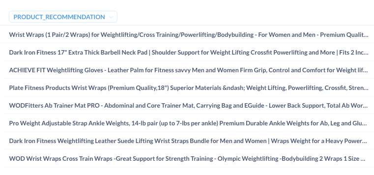

 

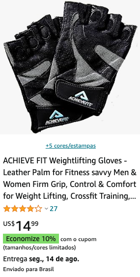

### 5. TEAM 🇧🇷
 - Jessica Caroline Costa e Silva - Data Engineer | <b> [LinkedIn](https://www.linkedin.com/in/jessicaccostaesilva/) </b> | <b> [Github](https://github.com/jess197) </b> 
 - Luan José de Almeida Cardoso - Data Engineer | <b> [LinkedIn](https://www.linkedin.com/in/luanjosecar/) </b> | <b> [Github](https://github.com/luanjosecar) </b>
  - Brunno Kalyxton Sousa Ramos - Data Scientist | <b> [LinkedIn](https://www.linkedin.com/in/brunno-kalyxton-sousa-ramos-79a37817b/) </b> | <b> [Github](https://github.com/bksramos) </b>
 - Gabrielle Moura - Data Analyst |<b> [LinkedIn](https://www.linkedin.com/in/gabrielle-moura-a3a782156/) </b> | <b> [Github](https://github.com/gabymoura) </b>
    

### 6. TECH STACK  
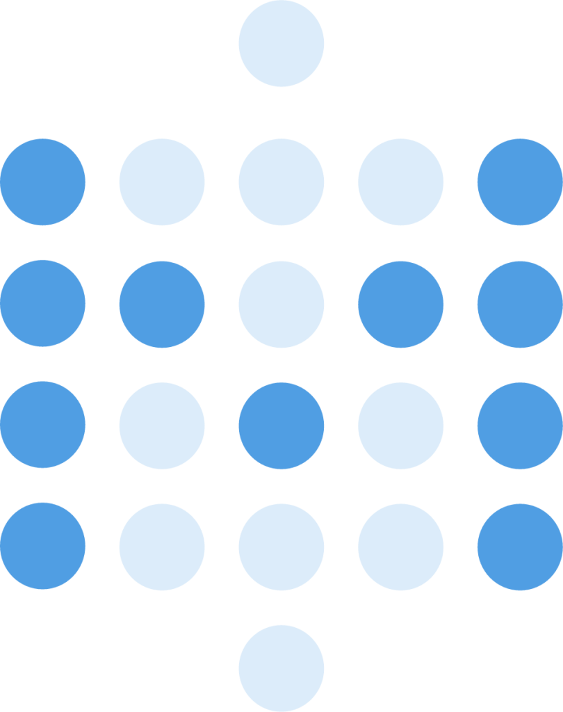
